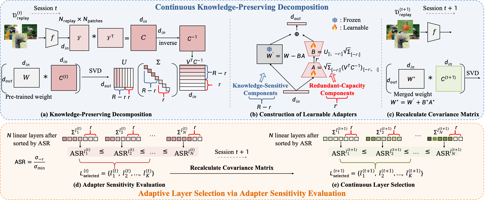

# Continuous Knowledge-Preserving Decomposition for Few-Shot Continual Learning

This is the official repository for "Continuous Knowledge-Preserving Decomposition for Few-Shot Continual Learning."

> **Continuous Knowledge-Preserving Decomposition for Few-Shot Continual Learning [PDF](https://arxiv.org/abs/2501.05017)**<br>
> [Xiaojie Li](https://xiaojieli0903.github.io/)^12, [Yibo Yang](https://yibo.yang93.github.io/)^2, [Jianlong Wu](https://wujianlong.hit.github.io)^1, [David A. Clifton](https://scholar.google.com/citations?user=mFN2KJ4AAAAJ&hl=en)^4, [Yue Yu](https://yuyue.github.io/)^2, [Bernard Ghanem](https://www.bernardghanem.com/)^2, [Min Zhang](https://zhangmin2021.hit.github.io)^1<br>
> ^1Harbin Institute of Technology (Shenzhen), ^2Peng Cheng Laboratory, ^3King Abdullah University of Science and Technology (KAUST), ^4University of Oxford



## 📒 Updates
* **16 Jan 2025** Released the code.
* **9 Jan 2025** Released the paper.

## 🔨 Installation

1. **Create Conda environment**:

   ```bash
   conda create --name ckpdfscil python=3.10 -y
   conda activate ckpdfscil
   ```

2. **Install dependencies**:

   ```bash
   pip install torch==1.12.1+cu113 torchvision==0.13.1+cu113 torchaudio==0.12.1 --extra-index-url https://download.pytorch.org/whl/cu113
   pip install -U openmim
   mim install mmcv-full==1.7.0 mmengine==0.10.4
   pip install opencv-python matplotlib einops timm==0.6.12 scikit-learn transformers==4.44.2
   pip install git+https://github.com/openai/CLIP.git
   git clone https://github.com/state-spaces/mamba.git && cd mamba && git checkout v1.2.0.post1 && pip install .
   ```

3. **Clone the repository**:

   ```bash
   git clone https://github.com/xiaojieli0903/CKPD-FSCIL.git
   cd Mamba-FSCIL && mkdir ./data
   ```

---

## ➡️ Data Preparation

1. **Download datasets** from [NC-FSCIL link](https://huggingface.co/datasets/HarborYuan/Few-Shot-Class-Incremental-Learning/blob/main/fscil.zip).

2. **Organize the datasets**:

   ```bash
   ./data/
   ├── cifar/
   ├── CUB_200_2011/
   └── miniimagenet/
   ```

---

## ➡️ Pretrained Models Preparation

Use `tools/convert_pretrained_model.py` to convert models. Supported types:

- **CLIP**: Converts OpenAI CLIP models.
- **TIMM**: Converts TIMM models.

### Commands

- **CLIP Model**:

  ```bash
  python tools/convert_pretrained_model.py ViT-B/32 ./pretrained_models/clip-vit-base-p32_openai.pth --model-type clip
  ```

- **TIMM Model**:

  ```bash
  python tools/convert_pretrained_model.py vit_base_patch16_224 ./pretrained_models/vit_base_patch16_224.pth --model-type timm
  ```

---


## 🚀 Training
Execute the provided scripts to start training:

### Mini Imagenet
```commandline
sh train_miniimagenet.sh
```

### CUB
```commandline
sh train_cub.sh
```

## ✏️ Citation
If you find our work useful in your research, please consider citing:
```
@article{li2025continuous,
  title={Continuous Knowledge-Preserving Decomposition for Few-Shot Continual Learning},
  author={Li, Xiaojie and Yang, Yibo and Wu, Jianlong and Clifton, David A and Yu, Yue and Ghanem, Bernard and Zhang, Min},
  journal={arXiv preprint arXiv:2501.05017},
  year={2025}
}
```